# edonline

A polished Flarum 2 theme for support forums with a marketplace storefront. Designed to pair with [`linkrobins/support`](https://github.com/linkrobins/support) and the [Flarum Marketplace](https://discuss.flarum.org/d/39158-flarum-marketplace) extension by ramon, but works as a standalone visual theme too.

> **Status:** v0.1.0 — initial scaffold. LESS theme is complete, JS components are in place, design preview ships in [`preview/`](preview/).

---

## Renders

All six surfaces, both light and dark mode. Click any thumbnail for the full-resolution capture.

### Forum landing — discussion list with hero, stats strip, and category tiles

| Light | Dark |
| :---: | :---: |
| [](docs/screenshots/index-light.png) | [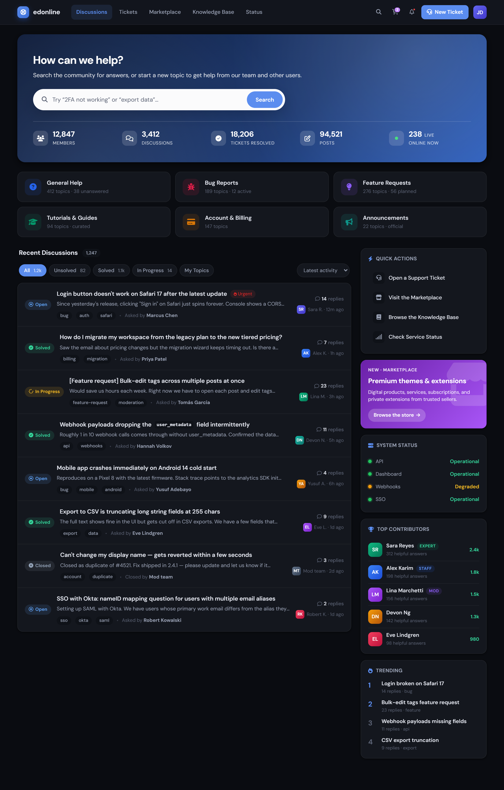](docs/screenshots/index-dark.png) |

### Discussion view — best-answer highlight, replies, composer

| Light | Dark |
| :---: | :---: |
| [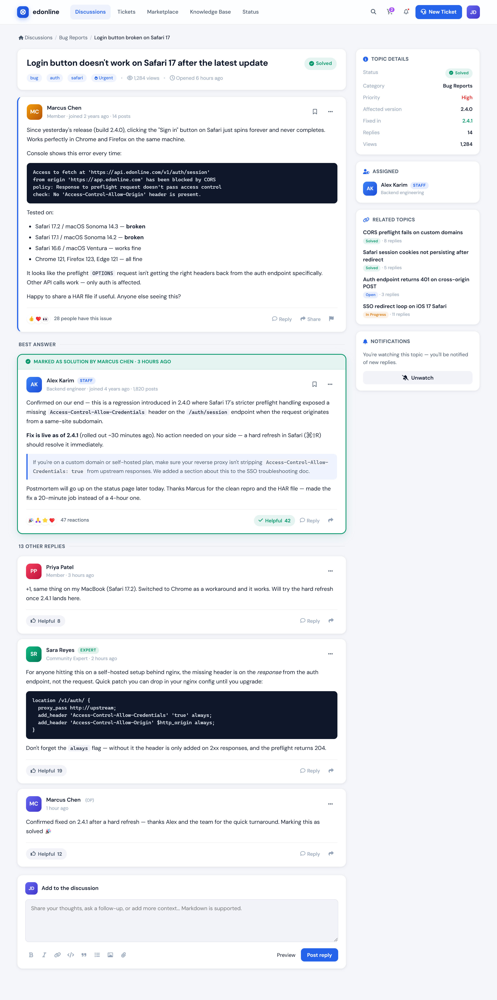](docs/screenshots/discussion-light.png) | [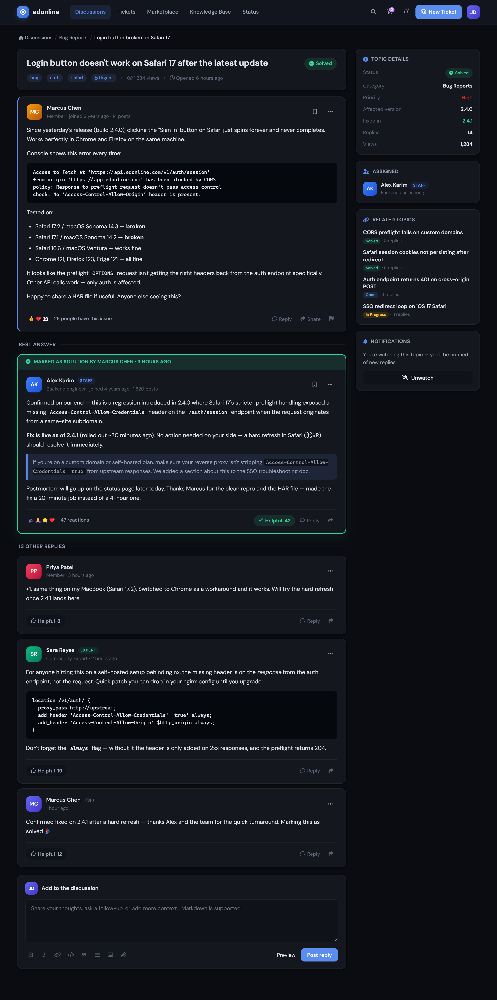](docs/screenshots/discussion-dark.png) |

### Support tickets — 5-state workflow (`linkrobins/support`)

| Light | Dark |
| :---: | :---: |
| [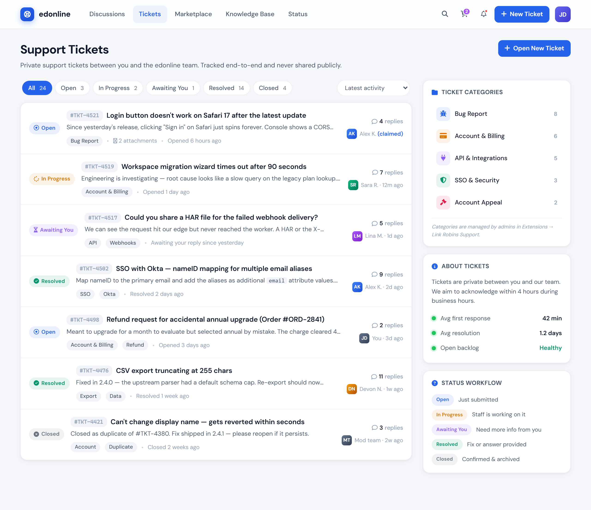](docs/screenshots/tickets-light.png) | [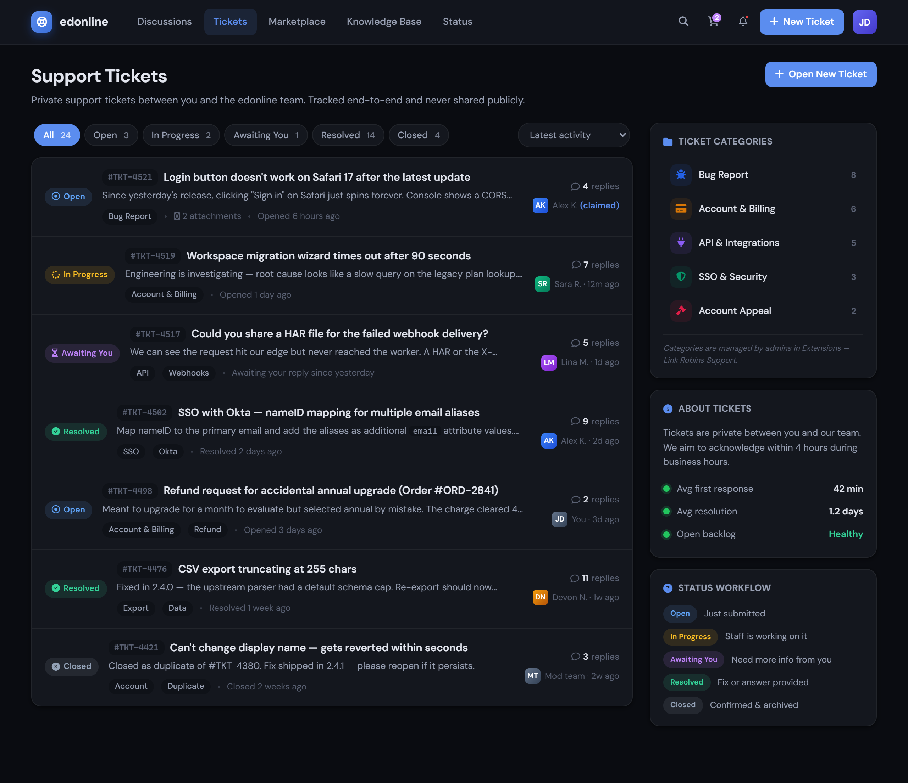](docs/screenshots/tickets-dark.png) |

### Single ticket — staff control bar, internal note, attachments

| Light | Dark |
| :---: | :---: |
| [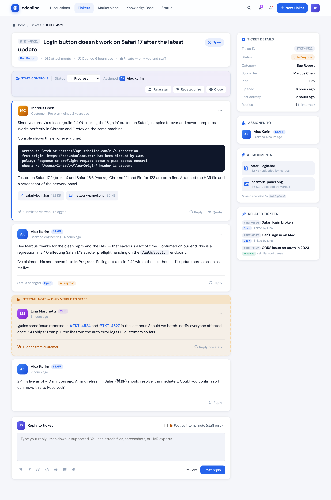](docs/screenshots/ticket-light.png) | [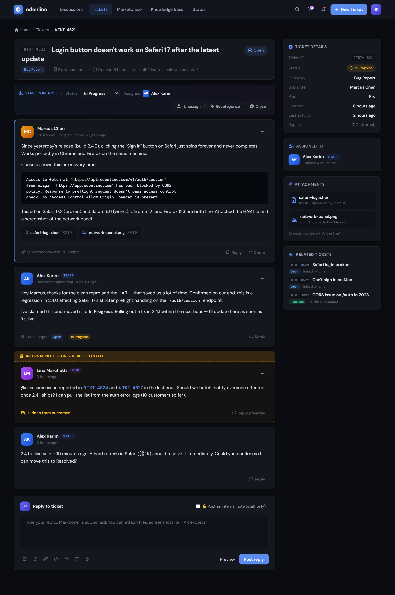](docs/screenshots/ticket-dark.png) |

### Marketplace storefront — `ramon/marketplace`

| Light | Dark |
| :---: | :---: |
| [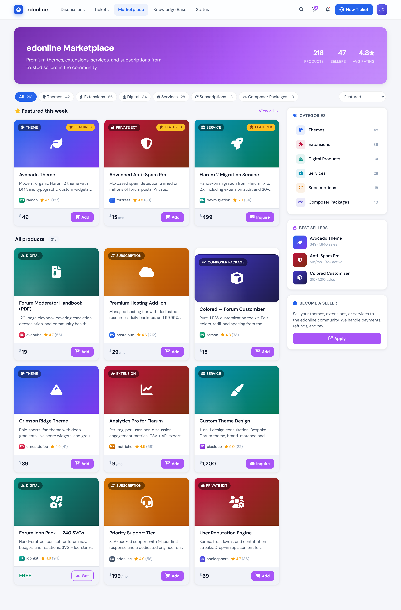](docs/screenshots/marketplace-light.png) | [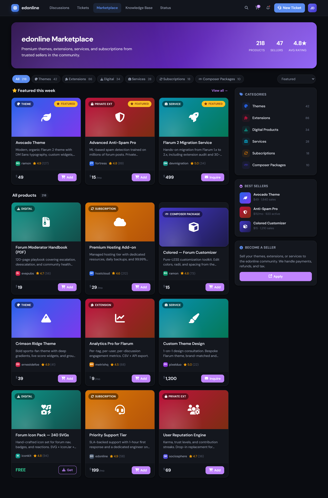](docs/screenshots/marketplace-dark.png) |

### Product detail — gallery, buy card, reviews

| Light | Dark |
| :---: | :---: |
| [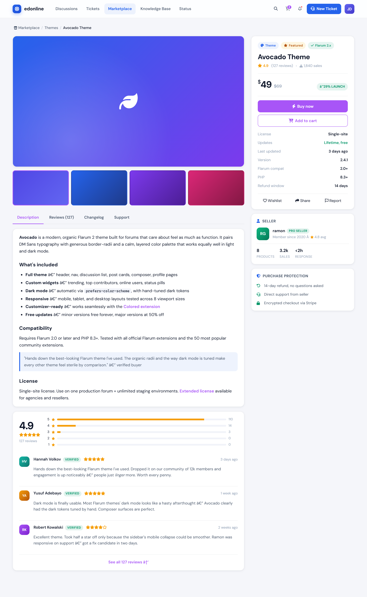](docs/screenshots/product-light.png) | [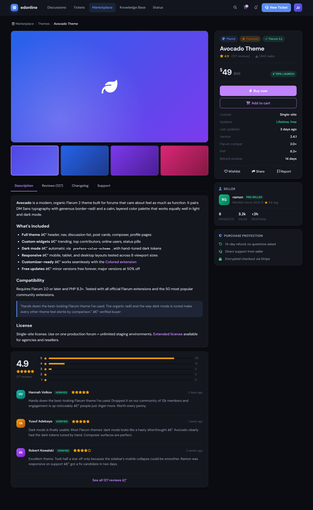](docs/screenshots/product-dark.png) |

---

## What you get

- **Polished hero panel** with title, search, and a 5-column forum-wide stats strip (Members / Discussions / Tickets Resolved / Posts / Online Now)
- **Category tiles** below the hero — auto-populated from `flarum/tags` when installed, hardcoded fallback otherwise
- **5-state ticket workflow** styling for `linkrobins/support`: Open → In Progress → Awaiting You → Resolved → Closed
- **Staff control bar** for tickets — status dropdown, claim/unassign, recategorize, close
- **Internal note** styling — amber-dashed staff-only replies with a "Hidden from customer" footer
- **Marketplace storefront** styling for `ramon/marketplace`: product cards with type badges, sticky buy card with reviews, cart icon with badge
- **Marketplace promo sidebar card** auto-injected on the IndexPage
- **Full dark mode** via `prefers-color-scheme` — the cascade block is placed last so dark tokens win cleanly
- **DM Sans** typography, organic 14px radii, calm blue + green/amber/purple status palette

## Install

```bash
composer require ernestdefoe/edonline
php flarum cache:clear
```

Then enable in **Admin → Extensions → edonline**.

## Develop

```bash
cd js
npm install
npm run dev      # watch mode
npm run build    # production
```

The frontend uses `flarum-webpack-config` v3 — `js/forum.js` and `js/admin.js` are auto-discovered, with webpack running from `js/` (cwd) and emitting to `js/dist/`. See `js/src/forum/index.js` for the extension's entry point. Compiled bundles in `js/dist/` are committed because Flarum extensions installed via Composer ship prebuilt assets.

### Re-capturing the screenshots

The renders above are generated by a small Puppeteer script in `_scratch/shotter/`. To regenerate them:

```bash
# Serve preview/ on port 5175
npx serve preview -l 5175

# In another terminal
cd ../_scratch/shotter
npm install      # one-time
node shoot.js    # writes into ../../edonline/docs/screenshots/
```

## Structure

```
edonline/
├── composer.json       # Flarum 2 extension manifest
├── extend.php          # PHP extender — registers forum/admin frontends
├── js/
│   ├── package.json        # JS deps (webpack, flarum-webpack-config v3)
│   ├── webpack.config.js   # one-liner using flarum-webpack-config
│   ├── forum.js            # entry (exports src/forum) — discovered by webpack at cwd
│   ├── admin.js            # entry (exports src/admin)
│   ├── dist/               # compiled bundles, committed to the repo
│   └── src/
│       ├── forum/
│       │   ├── index.js               # initializer + IndexPage hooks
│       │   ├── extend.js              # programmatic extenders (currently empty)
│       │   └── components/
│       │       ├── HeroPanel.js              # branded hero + stats strip
│       │       ├── CategoryTiles.js          # 6-tile category grid
│       │       └── MarketplacePromoCard.js   # sidebar CTA
│       └── admin/
│           ├── index.js
│           └── extend.js
├── less/
│   ├── forum.less                # entry — imports the rest
│   ├── _tokens.less              # CSS custom properties + Flarum LESS vars
│   ├── _base.less                # body, typography, scrollbar
│   ├── _header.less              # nav, brand, buttons
│   ├── _hero.less                # hero panel + stats strip
│   ├── _categories.less          # category tile grid
│   ├── _discussions.less         # discussion list + filter chips + status pills
│   ├── _post.less                # post stream, best-answer, code blocks
│   ├── _sidebar.less             # side cards, quick actions, marketplace promo
│   ├── _composer.less            # reply composer styling
│   ├── _support.less             # linkrobins/support overrides
│   ├── _marketplace.less         # ramon/marketplace overrides
│   ├── _dark.less                # @media (prefers-color-scheme: dark) — MUST be last
│   └── admin.less
├── locale/
│   └── en.yml
├── docs/
│   └── screenshots/              # rendered captures used in this README
└── preview/                      # static HTML mockup (design source of truth)
    ├── index.html
    ├── discussion.html
    ├── tickets.html
    ├── ticket.html
    ├── marketplace.html
    ├── product.html
    └── theme.css
```

## Hooking real data into the stats strip

`HeroPanel` reads from `app.forum.attribute(...)`. Flarum core exposes `discussionCount` out of the box; the rest (`userCount`, `postCount`, `onlineUserCount`, `resolvedTicketCount`) you wire up either through:

1. A small backend extension that adds them via `Extend\ApiSerializer(Flarum\Api\Serializer\ForumSerializer)->attributes(...)`, **or**
2. An existing stats extension such as `flarum-ext-statistics`.

Missing attributes fall back to `—` so the layout never breaks.

## Pairing with the extensions

| Surface | Source | Where styled |
|---|---|---|
| Discussion list / detail | Flarum core | `_discussions.less`, `_post.less` |
| Tickets (5-state workflow, internal notes) | `linkrobins/support` | `_support.less` |
| Marketplace storefront / product detail / cart | `ramon/marketplace` (paid) | `_marketplace.less` |
| Best-answer highlight | `fof/best-answer` *(optional)* | `_post.less` `.Post--bestAnswer` |
| File attachments on tickets | `fof/upload` *(optional)* | inherited via Flarum styling |

The CSS class names in `_support.less` and `_marketplace.less` are written against expected conventions. If either extension uses different class names, swap the selectors — the token-driven base styles still flow through Flarum's stock classes.

## Design preview

The [`preview/`](preview/) directory ships a static HTML mockup of every surface — open `preview/index.html` in a browser or run `npx serve preview/` to see the design without a Flarum install. Treat that mockup as the visual source of truth when the LESS and JS need to evolve.

## Credits

- **DM Sans** by Colophon Foundry, via Google Fonts
- **Font Awesome 7** for iconography
- Visual cues borrowed from [Avocado](https://discuss.flarum.org/d/27126) by ramon

## License

MIT — see [LICENSE](LICENSE).
